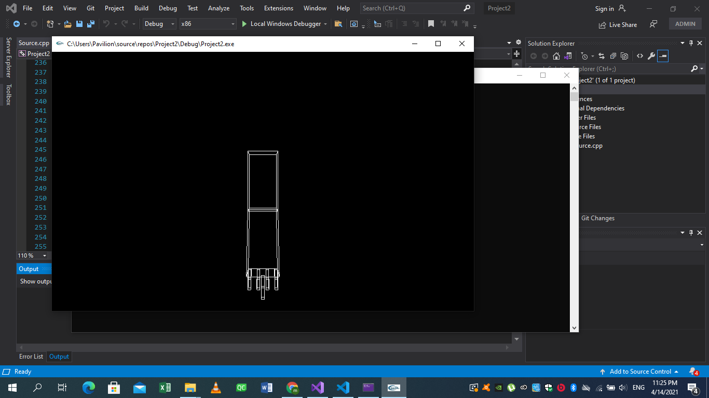
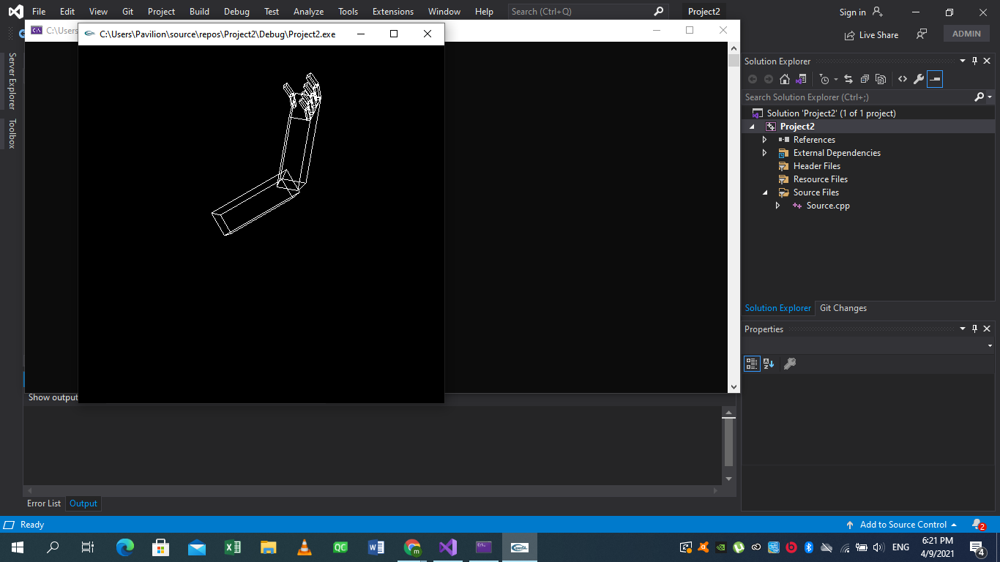
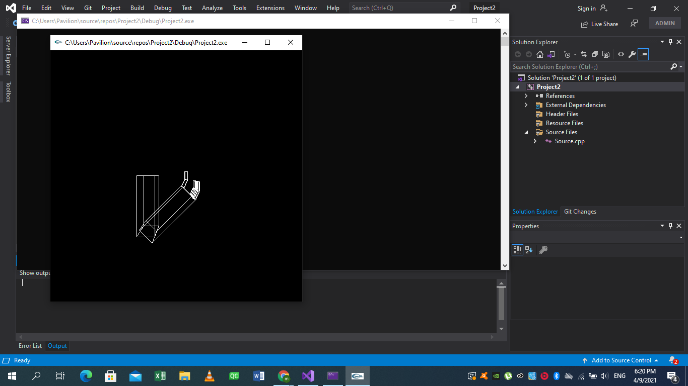
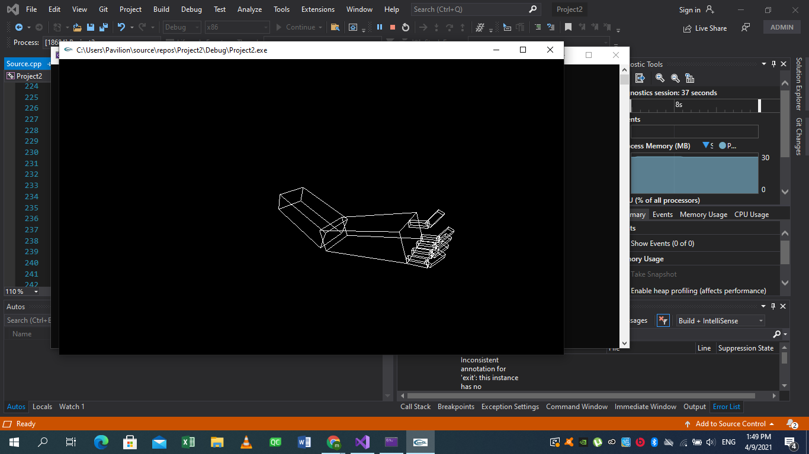
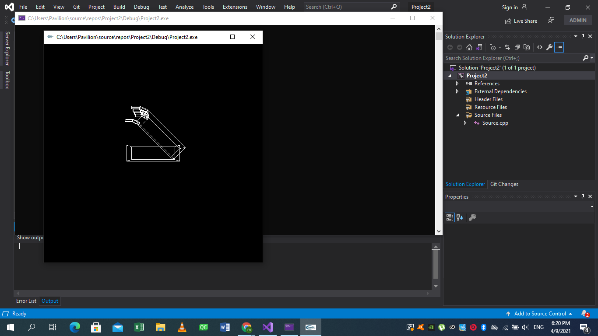
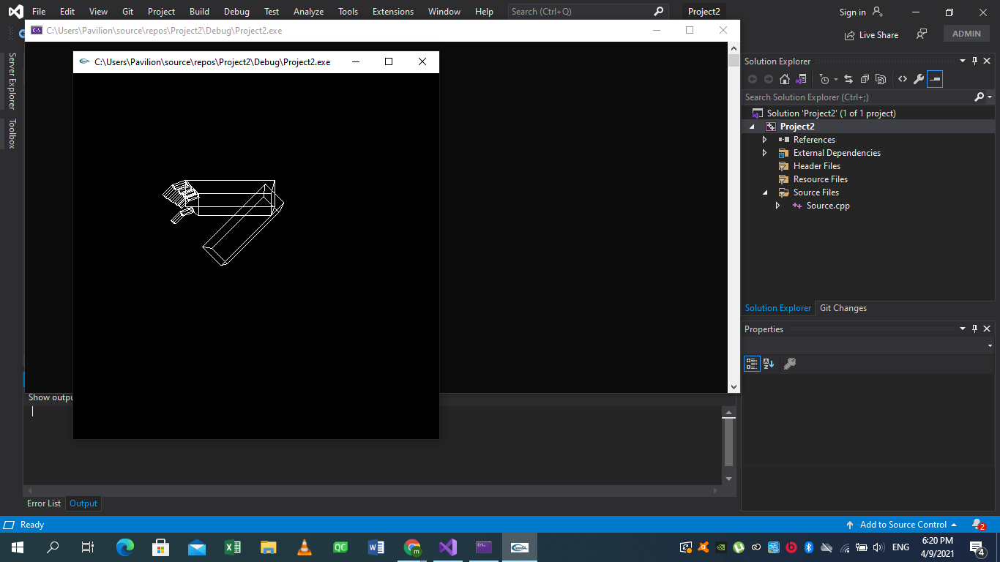

# Assignment-1-robot-arm

**NAME :** Meeran Ahmed Mostafa

&nbsp;

**SEC :** 2     **BN :** 33 

&nbsp;

# implementation details

 First i added 4 fingers same as the one in the helper code. while the creation of every finger i added __glPushmatrix()__ at the start of the code and __glPopmatrix()__ so the translations and rotations are applied only to that finger __only__.

&nbsp;

# Movement Limitations:
* As the normal range of motion for shoulder flexion is 180 degrees ,and the normal range of motion for shoulder extension is between 45 and 60 degrees.

* The  range of flexion movements of the elbow joint  is 135°–150° , and the extension movement is 0° as the elbow won't rotate downwards.  

* The flexion movements of the fingerbase and fingerUp is 90°, and aslo the extension movement is 0° as the fingers won't rotate downwards.

The above flexion and extention angles may not be accurate 100% but i guessed it logically. Also i assumed that 0° is when the arm is held downword as shown in the first images in the code results.

# Code Results

&nbsp;

&nbsp;

&nbsp;

&nbsp;

&nbsp;

&nbsp;

